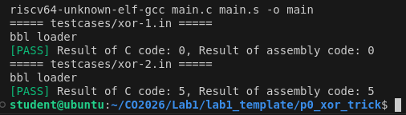
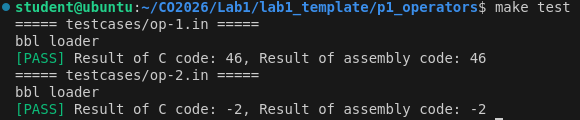
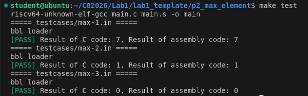
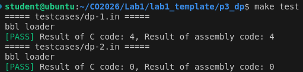
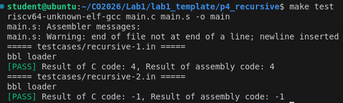
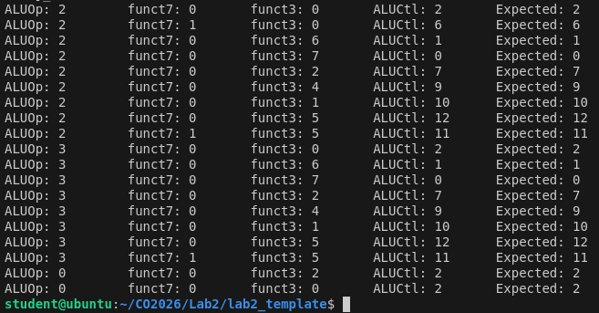
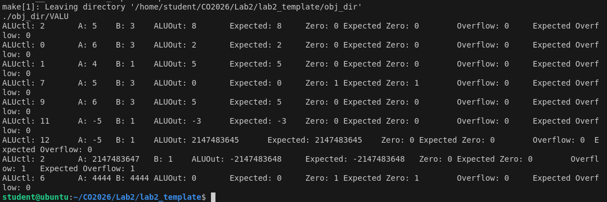
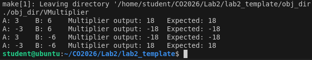
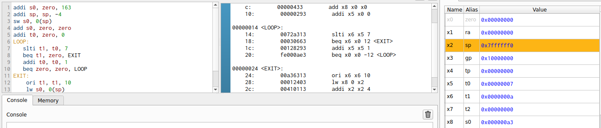
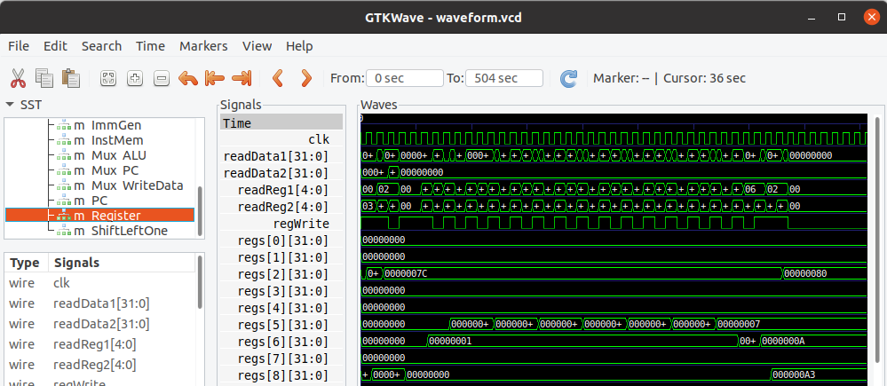

## Self-learning project, with images (code is not shown in this repo)
# Lab 1: 
xor_operator: 
---
operators: 
---
max_element: 
---
2D dynamic programming: 
---
binary search recursion: 
---

# Lab 2:
ALUcontrol: 
---
ALU: 
---
Booth algorithm: 
---

# Lab 3:
Ripes: 
---
GTKwave: 
---

## Link to main repository of Computer Organization 2026, NYCU.
Check out the main repo [lecture main github](https://github.com/nycu-caslab/CO2026/tree/main)
